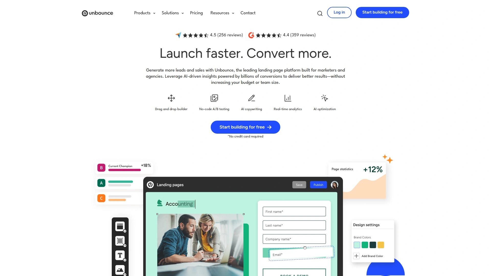
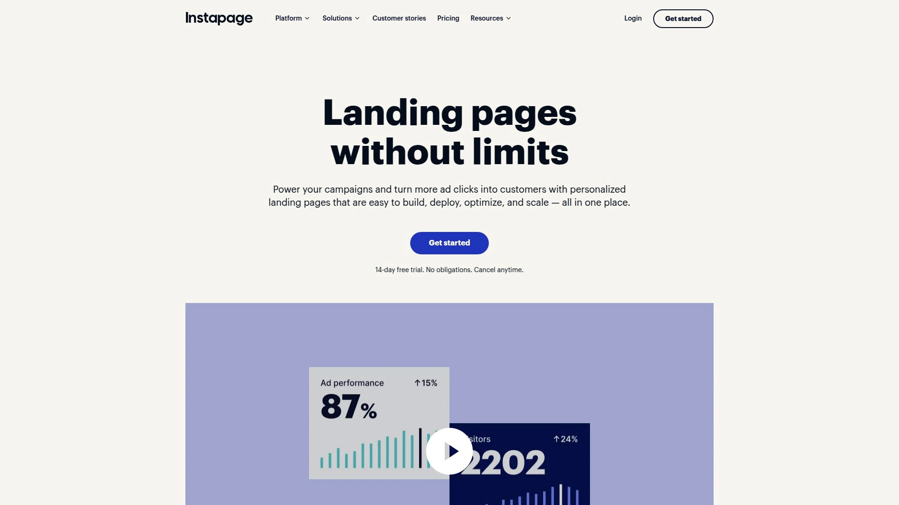

# Top 12 AI Website Builders Ranked in 2025 (Latest Compilation)

Picture this: you've got a brilliant startup idea, but the thought of hiring a developer or wrestling with code makes your head spin. You need a website live yesterday, not next month. That's where AI website builders swoop in like your tech-savvy friend who actually knows what they're doing. These platforms turn your rough concepts into polished landing pages faster than you can finish your coffee, no design degree required. Whether you're testing a product idea, launching a side project, or building your first business, the right tool makes the difference between "I'll do it someday" and "It's live right now."

## **[Mixo](https://www.mixo.io)**

Your startup idea generator and validation machine rolled into one.

Mixo specializes in getting entrepreneurs from concept to live website in literal seconds, making it the go-to choice for founders who need to test ideas quickly. The platform generates complete landing pages from brief descriptions, eliminating the typical paralysis that comes with choosing templates or designing layouts.

The built-in email waiting list system transforms your site into an immediate validation tool. You're not just launching a pretty page—you're building a subscriber base before your product even exists. This matters when you're trying to gauge real interest rather than just hoping people care about your idea.

What sets Mixo apart is how it handles the entire pre-launch lifecycle. Connect with potential customers through integrated surveys and interviews without juggling multiple platforms. The subscriber management tools let you track engagement and export contacts to your preferred marketing software when you're ready to scale. Over 750,000 creators trust the platform because it removes technical friction from the most critical early-stage question: does anyone actually want this thing you're building?

## **[Wix AI](https://www.wix.com)**

End-to-end intelligence that builds, writes, and optimizes your entire web presence.

Wix transformed its original ADI technology into a comprehensive AI ecosystem that handles everything from initial site creation to ongoing content generation. The chat-based interface lets you describe your vision conversationally, then watches as the system generates custom layouts, images, and brand-consistent copy.

The real power emerges after your site launches. Need new sections? Just describe what you want and the AI assembles appropriate designs with relevant content and imagery. The text creator adapts to your brand voice across product descriptions, blog posts, and marketing materials. Even image editing gets the AI treatment—create visuals or modify existing ones without touching Photoshop.

For businesses managing inventory, Wix includes AI-powered product recommendations and support chatbots that handle customer questions automatically. The SEO tools analyze your content and suggest optimizations that actually improve search rankings. With over 3 million sites created, Wix proves that sophisticated AI doesn't require sacrificing creative control.

## **[Squarespace Blueprint AI](https://www.squarespace.com)**

Design-first intelligence that assembles beautiful sites like solving an elegant puzzle.

Squarespace takes a different approach from conversational builders—Blueprint AI guides you through five deliberate steps that shape your website's foundation. You make intentional choices about layouts, typography, and color schemes while the system ensures everything coheres into a polished final product.

This method appeals to creatives and service businesses where aesthetic quality directly impacts credibility. The templates start strong and maintain visual consistency as you customize. Unlike platforms drowning you in options, Blueprint curates suggestions based on your industry and stated preferences.

The trade-off? Fewer AI tools beyond the initial build compared to competitors. You get solid text generation for product descriptions and site copy, plus reliable SEO foundations. Squarespace excels when your priority is launching something that looks professionally designed rather than rapidly iterating multiple concepts. The platform earned its reputation among portfolios and creative businesses for good reason—beauty matters, and Blueprint delivers it consistently.

## **[Hostinger AI Website Builder](https://www.hostinger.com)**

Lightning-fast setup with the most flexible drag-and-drop freedom you'll find.

Hostinger strips away complexity—pick your hosting plan, describe your website needs, optionally choose colors, and watch your site materialize. The entire process takes under a minute, making it genuinely the fastest option for getting a functional site breathing online.

Where Hostinger shines brightest is post-generation editing. The drag-and-drop system lets you place elements literally anywhere on the page while grid assistance keeps everything proportional. This flexibility beats rigid template systems where moving a button three inches left requires workarounds. The AI heatmap tool reveals how visitors actually interact with your pages, letting you optimize based on behavior rather than guessing.

Pricing scales smartly too. Need more server resources as traffic grows? Upgrade hosting without paying for redundant features other builders bundle into expensive tiers. Starting at $2.99 monthly, Hostinger targets budget-conscious founders and freelancers who refuse to sacrifice quality. The platform includes 150+ templates if you prefer starting with structure, but the AI generation handles most heavy lifting.

## **[Framer AI](https://www.framer.com)**

Design-centric powerhouse where animation and interactivity become effortless.

Framer evolved from prototyping tool to full website builder, bringing sophisticated design capabilities that typically require developer collaboration. The AI assistant generates complete layouts from text prompts, then helps you refine colors and rewrite copy conversationally. What makes Framer special is how it handles motion—animations and interactions that bring pages alive happen through visual tools rather than code.

The Figma integration appeals to designers already working in that ecosystem. Copy layers directly or use the Figma plugin to transfer entire layouts with automatic spacing adjustments. The built-in CMS manages content collections like blog posts or product listings, letting you display dynamic content without database headaches.

Framer supports translation into 500+ languages through AI, making international launches straightforward. The platform attracts creators who understand that user experience extends beyond static layouts—when elements respond smoothly to interactions, visitors stay engaged longer. If your project demands visual sophistication and you're willing to invest time learning the interface, Framer delivers results that stand out.

## **[Durable](https://durable.co)**

Business-in-a-box that generates your website plus all the tools to run operations.

Durable lives up to its name by building a complete website in 30 seconds, then surrounding it with integrated business software. You get AI-generated copy optimized for conversions, SEO-ready pages that Google can index immediately, and automatic blog content published weekly. The system writes like a professional copywriter, which matters when you're not one.

Beyond the website itself, Durable includes invoicing tools that speed up payments and contact management that consolidates lead tracking. This integration eliminates the typical startup juggle of managing separate platforms for website, billing, and customer relationships. Over 3 million business owners trust Durable specifically because it handles the unsexy operational tasks alongside the public-facing site.

The platform targets service businesses and small companies that need functional websites without complexity. Setup requires minimal decisions—describe your business and let AI handle design, structure, and messaging. While customization options are more limited than design-first builders, that constraint actually helps overwhelmed founders who just need something solid running quickly.

## **[10Web](https://10web.io)**

WordPress optimization specialist that rebuilds and supercharges existing sites with AI.

10Web occupies a unique position by focusing on WordPress sites rather than proprietary systems. The AI website builder creates new WordPress installations optimized for speed from the start, or takes existing sites and reconstructs them for better performance. This matters enormously for businesses already invested in WordPress who want AI benefits without platform migration.

The optimization goes deep—automatic speed enhancements, AI content assistance, and comprehensive tool suite for managing WordPress hosting. For WooCommerce stores, 10Web provides ecommerce-specific optimizations that general builders can't match. The platform essentially serves as your WordPress expert team, handling technical improvements you'd otherwise need developers to implement.

The learning curve steeper than simpler builders because WordPress itself has complexity. However, that complexity brings power—full control over your site's functionality and the entire WordPress plugin ecosystem. If you need a serious business website with scalability and want WordPress specifically, 10Web delivers AI capabilities without sacrificing the platform's inherent flexibility.

## **[ZipWP](https://zipwp.com)**

Free WordPress site generator from the team behind the popular Astra theme.

ZipWP removes cost barriers from AI website creation while focusing specifically on WordPress. Created by Brainstorm Force, the company behind Astra theme used by millions, the platform generates 50+ website variations from your prompts. Upload your brand images before generation and they'll be incorporated from the start, ensuring visual consistency.

The process involves answering questions about your site's purpose, entering detailed descriptions, then reviewing multiple generated options. This abundance of choices increases the likelihood of finding something that matches your vision without endless manual tweaking. You can specify features like contact forms, donation systems, or ecommerce functionality during setup.

ZipWP pairs with the Spectra website builder, which works within WordPress's block editor. This integration means you edit content and design in one place rather than switching between interfaces. The platform requires exporting your generated design and importing it into your own WordPress installation, adding a step compared to hosted solutions. For founders prioritizing WordPress while keeping budgets tight, ZipWP delivers impressive results at zero upfront cost.

## **[Relume](https://www.relume.io)**

Professional designer's AI assistant that builds sitemaps, wireframes, and Webflow-ready sites.

Relume targets professional web designers rather than replacing them. The AI generates comprehensive sitemaps showing not just pages but the specific sections each page needs and their purposes. This structural intelligence speeds up the planning phase dramatically—you're not starting from blank canvas paralysis.

The wireframing step converts your sitemap into high-fidelity layouts using components from Relume's Figma kit. Don't like a section? Swap through variations for that component category. AI-generated content fills each section, giving clients realistic previews immediately. You maintain creative control over design decisions while the AI handles the grunt work of structure and initial content.

The Webflow integration means you can copy entire wireframes directly into Webflow and add your styling changes from Figma. This workflow appeals to agencies and freelancers building custom client sites where quality and customization matter more than speed. Relume also works with Figma, Framer, and other builders, making it tool-agnostic. If you're a professional charging premium rates, Relume justifies its cost by compressing weeks of work into days.

## **[B12](https://www.b12.io)**

AI draft generator paired with human experts who polish your site professionally.

B12 takes a hybrid approach—AI creates your initial website in under a minute, then their team of copywriters, designers, and SEO specialists refine everything to professional standards. This combination suits professional services providers who need credibility but lack design skills or time.

The platform includes robust business tools beyond the website itself. Client management features handle scheduling, intake forms, calendar syncing, and file uploads. Online payments and invoicing with currency conversion make getting paid straightforward. Email marketing and automated payment reminders round out the business operations side.

B12's free plan includes hosting, mobile-friendly pages, unlimited bandwidth, and analytics. Paid plans add custom domains, third-party integrations, and access to the expert team for professional customization. The platform integrates with Calendly, PayPal, Shopify, and dozens of other services. While more expensive than pure DIY builders, B12 occupies the middle ground between cheap templates and hiring an agency—you get professional results without agency timelines or budgets.

## **[Unbounce](https://unbounce.com)**

Conversion optimization platform with AI that creates and tests landing pages for maximum results.

Unbounce built its reputation on helping marketers achieve higher conversion rates through systematic testing. The AI landing page builder generates pages quickly, but the real value lives in the optimization tools—A/B testing capabilities, dynamic text replacement that personalizes content based on ad source, and analytics that reveal exactly what's working.

The platform targets businesses running paid advertising campaigns who need landing pages that match specific ads. Smart Traffic automatically routes visitors to the page variation most likely to convert them based on behavioral patterns. This machine learning optimization happens in real-time, improving results without manual intervention.

Integration with CRM and email platforms connects your landing pages to broader marketing systems. The no-code builder provides extensive customization while maintaining fast load times. Unbounce suits established businesses willing to invest in conversion rate optimization rather than startups just needing a basic presence. The 14-day free trial lets you test whether the platform's advanced features justify the premium pricing.

## **[Instapage](https://instapage.com)**

Enterprise-grade landing page platform emphasizing personalization and team collaboration.

Instapage positions itself as the sophisticated option for companies running complex marketing campaigns across multiple customer segments. The platform excels at creating personalized landing page experiences—different visitors see variations tailored to their demographics, behavior, or ad source. This personalization typically requires developer resources; Instapage makes it accessible through visual tools.

The collaboration features let marketing teams work together seamlessly with real-time editing and commenting. Built-in AMP support ensures lightning-fast mobile load times, critical when milliseconds impact conversion rates. Advanced caching and CDN integration optimize global performance automatically.

Instapage provides heat maps showing exactly where visitors click and how they navigate your pages. Combined with A/B testing, these insights drive iterative improvements based on data rather than hunches. The 14-day free trial offers complete access to explore whether enterprise features align with your needs. For marketing teams managing substantial ad budgets where small conversion improvements generate significant revenue, Instapage delivers the sophistication worth its premium pricing.

## FAQ

**How quickly can these AI builders actually create a functional website?**

The fastest platforms like Mixo, Durable, and Hostinger generate complete websites in 30 seconds to one minute. You describe your business briefly, and AI produces a fully functional site with content, images, and structure. More design-focused options like Squarespace Blueprint or Relume take 5-15 minutes because they walk you through intentional design choices. The speed depends on whether you want instant deployment or more customization during creation.

**Do I need coding skills to use these AI website builders?**

No coding required across all platforms mentioned. That's precisely why they exist—to eliminate the technical barrier between ideas and live websites. Tools like Wix, Framer, and Hostinger provide drag-and-drop interfaces where you visually arrange elements. Some platforms like 10Web and ZipWP work with WordPress, which adds slight complexity, but still no coding necessary. The AI handles all technical implementation while you focus on content and design preferences.

**Which builder works best for testing startup ideas before building the full product?**

Mixo specifically targets this use case with built-in waiting list management and subscriber tools designed for pre-launch validation. You get a professional landing page immediately plus systems to gauge real interest through signups, surveys, and interviews. Durable also works well for quick testing with its 30-second generation and integrated business tools. Both platforms prioritize speed and validation features over extensive customization, which matches the "test fast, iterate quickly" approach successful founders use for idea validation.

## Conclusion

Choosing your AI website builder ultimately depends on what you're actually trying to accomplish. Need to validate a startup concept this afternoon? [Mixo](https://www.mixo.io) gets you from idea to live landing page with subscriber collection in seconds, making it perfect for founders who value speed and built-in validation tools over endless design options. The platform removes every excuse standing between your concept and real market feedback—just describe your idea and start collecting signups immediately.

The broader landscape offers specialized tools for every scenario. Designers gravitating toward Framer's animation capabilities, WordPress users choosing 10Web's optimization power, and marketing teams needing Unbounce's conversion testing all find their ideal match. But when you're in that crucial moment of wanting to test whether anyone cares about your idea before investing months building it, speed and validation features matter most—exactly where Mixo excels.
